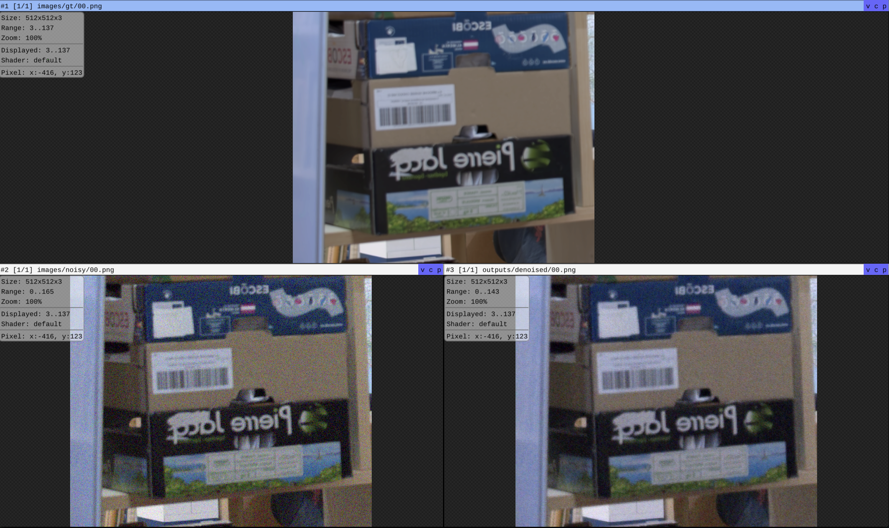

# ImageDenoiser

PyTorch implementation of the Enhance Lab image denoising assessment. The
project reconstructs the provided convolutional denoising network from
`architecture.jpg` and `weights.csv`, converts flattened CSV weights
into a PyTorch checkpoint, runs inference on noisy RGB images, and evaluates the
results with PSNR and SSIM.

## Repository Layout

```text
.
├── images/
│   ├── gt/                 # Ground-truth RGB images
│   └── noisy/              # Noisy RGB images to denoise
├── src/
│   ├── denoiser/model/     # PyTorch model and weight-loading utilities
│   └── evaluation/         # PSNR/SSIM metrics and plotting
├── tests/                  # Pytest regression test for inference
├── main_inference.py       # Inference CLI
├── llm_logs/
│   ├── codex_log.md        # Conversation log with Codex
│   └── cc_log.md           # Conversation log with Claude Code
├── architecture.jpg        # Original network diagram
├── model_architecture.png  # Interpreted architecture diagram
├── performance_check.png   # Denoising example image
├── prompt.md               # Initial prompt for Codex
└── pyproject.toml          # Project configuration file
```

Files that are intentionally ignored in github:

- `weights.csv`: large assessment-provided weight file.
- `checkpoint.pt`: converted PyTorch checkpoint created from `weights.csv`.
- `outputs/`: denoised images, metrics CSV, and metrics plot.

## Setup

This repository uses `uv` for Python environment management.

```bash
uv sync
```

The code uses the dependencies declared in `pyproject.toml`: PyTorch, pandas,
NumPy, Pillow, scikit-image, matplotlib, and pytest.

## Model And Weights

The model is implemented in
`src/denoiser/model/denoise_model.py`. It follows the supplied U-Net-like
architecture:

- RGB input head convolution.
- Three downsampling stages.
- Two bottleneck residual blocks.
- Three pixel-shuffle upsampling stages.
- RGB output tail convolution with an additive image skip connection.

Each residual block is:

```text
Conv2d 3x3 -> ReLU -> Conv2d 3x3 -> residual add
```

The CSV stores convolution weights flattened from
`(in_channels, out_channels, kernel_height, kernel_width)`. The conversion code
validates layer names and counts, reshapes each layer, permutes it to PyTorch's
`(out_channels, in_channels, kernel_height, kernel_width)` layout, and saves a
reusable `checkpoint.pt`.

The checkpoint is created automatically the first time inference or tests run,
as long as `weights.csv` is present at the repository root.

## Run Inference

Denoise all images in `images/noisy`:

```bash
uv run python main_inference.py \
  --input images/noisy \
  --output outputs/denoised \
  --checkpoint checkpoint.pt \
  --weights-csv weights.csv \
  --batch-size 4
```

Denoise a single image:

```bash
uv run python main_inference.py \
  --input images/noisy/00.png \
  --output outputs/denoised \
  --checkpoint checkpoint.pt \
  --weights-csv weights.csv
```

## Compute Metrics

After inference, compute PSNR and SSIM for noisy and denoised images against the
ground truth:

```bash
uv run python -m src.evaluation.compute_metrics \
  --gt-dir images/gt \
  --noisy-dir images/noisy \
  --denoised-dir outputs/denoised \
  --output-dir outputs/metrics
```

This writes:

- `outputs/metrics/metrics.csv`
- `outputs/metrics/metrics.png`

On the provided images, the corrected model produced the following average
metrics:

| Metric | Noisy | Denoised | Improvement |
|---|---:|---:|---:|
| PSNR | 28.2345 | 32.8445 | +4.6099 dB |
| SSIM | 0.5397 | 0.8146 | +0.2749 |

## Denoise Examples



## Tests

Run the regression test:

```bash
uv run pytest
```

The test recomputes inference for `images/noisy/00.png`, compares it against
`images/gt/00.png`, and verifies that both PSNR and SSIM improve over the noisy
input.

## Notes

- Input images are expected to be RGB and have dimensions divisible by 8.
- Convolution layers do not use bias terms, matching the assessment materials.
- The implementation keeps PyTorch parameter names aligned with `weights.csv`
  so checkpoint conversion can validate the architecture strictly.

## My workflow
- Read carefully `CandidateInstructions.md` to understand objectives.
- Data analysis on `weights.csv` together with `architecture.jpg` to fully understand the model architecture.
- Draw the detailed architecture diagram in `model_architecture.png`.
- Implement the solution using codex (details can be found at `llm_logs/codex_log.md`).
- Manually verify the results, make necessary adjustments. 
- Push to github, and keep tracking the progress in the repo.
- Ask Claude Code to double check and improve the solution (details can be found at `llm_logs/claude_code_log.md`). 
- Final manual fine-tune before submission.
